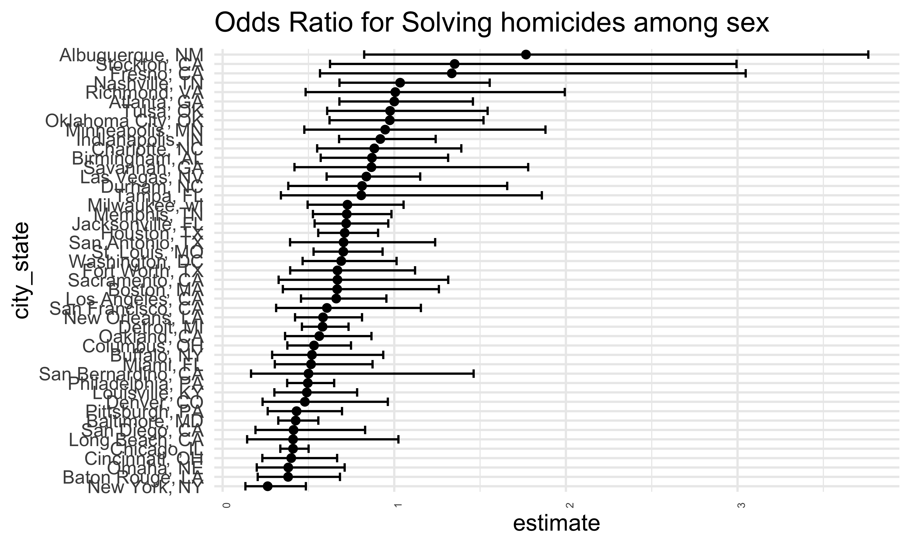

HW5
================
Bohan Zhu
2025-11-18

``` r
library(tidyverse)
```

    ## ── Attaching core tidyverse packages ──────────────────────── tidyverse 2.0.0 ──
    ## ✔ dplyr     1.1.4     ✔ readr     2.1.5
    ## ✔ forcats   1.0.0     ✔ stringr   1.5.1
    ## ✔ ggplot2   4.0.0     ✔ tibble    3.3.0
    ## ✔ lubridate 1.9.4     ✔ tidyr     1.3.1
    ## ✔ purrr     1.1.0     
    ## ── Conflicts ────────────────────────────────────────── tidyverse_conflicts() ──
    ## ✖ dplyr::filter() masks stats::filter()
    ## ✖ dplyr::lag()    masks stats::lag()
    ## ℹ Use the conflicted package (<http://conflicted.r-lib.org/>) to force all conflicts to become errors

## Problem 1

``` r
homicides = 
  read_csv("data/homicide-data.csv", 
           na = c("NA",".","","Unknown")) |>
  janitor::clean_names() 
```

    ## Rows: 52179 Columns: 12
    ## ── Column specification ────────────────────────────────────────────────────────
    ## Delimiter: ","
    ## chr (8): uid, victim_last, victim_first, victim_race, victim_sex, city, stat...
    ## dbl (4): reported_date, victim_age, lat, lon
    ## 
    ## ℹ Use `spec()` to retrieve the full column specification for this data.
    ## ℹ Specify the column types or set `show_col_types = FALSE` to quiet this message.

``` r
homicide_df = 
  homicides |> 
  mutate(
    city_state = str_c(city, ", ", state),
    status = ifelse(disposition == "Closed by arrest", 1, 0)
  ) |> 
  filter(
    !city_state %in% c("Dallas, TX", "Phoenix, AZ", "Kansas City, MO", "Tulsa, AL"),
    victim_race == "White" | victim_race == "Black"
  )
```

``` r
baltimore_df <- homicide_df |> 
  filter(city_state == "Baltimore, MD") |> 
  select(status, victim_age, victim_race, victim_sex)
```

``` r
fit_logistic = 
  baltimore_df |> 
  glm(status ~ victim_age + victim_race + victim_sex, data = _, 
      family = binomial())

fit_logistic |> 
  broom::tidy(conf.int = TRUE, exponentiate = TRUE) |> 
  filter(term == "victim_sexMale") |> 
  select(estimate, conf.low, conf.high) |> 
  knitr::kable(digits = 3)
```

| estimate | conf.low | conf.high |
|---------:|---------:|----------:|
|    0.426 |    0.324 |     0.558 |

``` r
fit_city_glm = function(df) {
  glm(status ~ victim_age + victim_race + victim_sex,
      data = df, family = binomial())
}

city_or_df =
  homicide_df |>
  nest(data = -city_state) |> 
  mutate(
    fits = map(data, fit_city_glm),
    results = map(fits, ~ broom::tidy(.x, conf.int = TRUE, exponentiate = TRUE))
  ) |>
  unnest(results) |>
  filter(term == "victim_sexMale") |>
  select(city_state, estimate, conf.low, conf.high)

city_or_df
```

    ## # A tibble: 47 × 4
    ##    city_state      estimate conf.low conf.high
    ##    <chr>              <dbl>    <dbl>     <dbl>
    ##  1 Albuquerque, NM    1.77     0.825     3.76 
    ##  2 Atlanta, GA        1.00     0.680     1.46 
    ##  3 Baltimore, MD      0.426    0.324     0.558
    ##  4 Baton Rouge, LA    0.381    0.204     0.684
    ##  5 Birmingham, AL     0.870    0.571     1.31 
    ##  6 Boston, MA         0.667    0.351     1.26 
    ##  7 Buffalo, NY        0.521    0.288     0.936
    ##  8 Charlotte, NC      0.884    0.551     1.39 
    ##  9 Chicago, IL        0.410    0.336     0.501
    ## 10 Cincinnati, OH     0.400    0.231     0.667
    ## # ℹ 37 more rows

``` r
city_or_df |> 
  mutate(
    city_state = fct_reorder(city_state, estimate)
    ) |>
  ggplot(aes( x = city_state, y = estimate)) +
  geom_point() +
  geom_errorbar(aes(ymin = conf.low, ymax = conf.high)) +
  theme(axis.text.x = element_text(size = 5,angle = 90,hjust = 1)) +
  coord_flip() +
  ggtitle("Odds Ratio for Solving homicides among sex")
```



## Problem 2

## Problem 3
