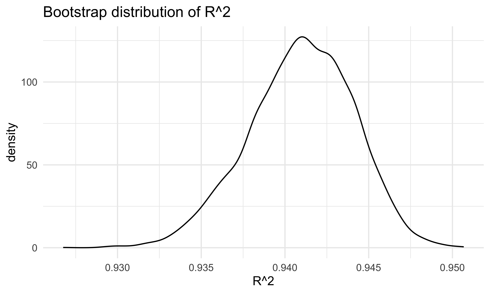
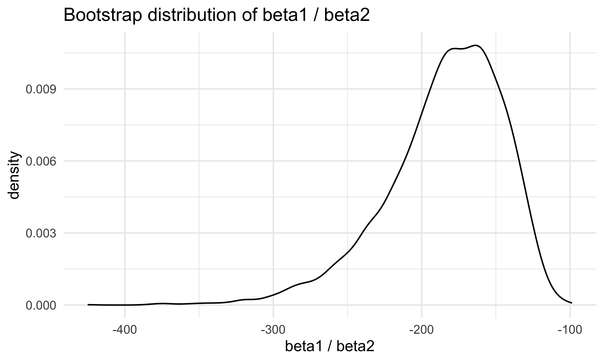

HW5
================
Bohan Zhu
2025-11-18

``` r
library(tidyverse)
```

    ## ── Attaching core tidyverse packages ──────────────────────── tidyverse 2.0.0 ──
    ## ✔ dplyr     1.1.4     ✔ readr     2.1.5
    ## ✔ forcats   1.0.0     ✔ stringr   1.5.1
    ## ✔ ggplot2   4.0.0     ✔ tibble    3.3.0
    ## ✔ lubridate 1.9.4     ✔ tidyr     1.3.1
    ## ✔ purrr     1.1.0     
    ## ── Conflicts ────────────────────────────────────────── tidyverse_conflicts() ──
    ## ✖ dplyr::filter() masks stats::filter()
    ## ✖ dplyr::lag()    masks stats::lag()
    ## ℹ Use the conflicted package (<http://conflicted.r-lib.org/>) to force all conflicts to become errors

``` r
library(p8105.datasets)
library(modelr)
```

``` r
set.seed(1)
```

## Problem 1

``` r
homicides = 
  read_csv("data/homicide-data.csv", 
           na = c("NA",".","","Unknown")) |>
  janitor::clean_names() 
```

    ## Rows: 52179 Columns: 12
    ## ── Column specification ────────────────────────────────────────────────────────
    ## Delimiter: ","
    ## chr (8): uid, victim_last, victim_first, victim_race, victim_sex, city, stat...
    ## dbl (4): reported_date, victim_age, lat, lon
    ## 
    ## ℹ Use `spec()` to retrieve the full column specification for this data.
    ## ℹ Specify the column types or set `show_col_types = FALSE` to quiet this message.

``` r
homicide_df = 
  homicides |> 
  mutate(
    city_state = str_c(city, ", ", state),
    status = ifelse(disposition == "Closed by arrest", 1, 0)
  ) |> 
  filter(
    !city_state %in% c("Dallas, TX", "Phoenix, AZ", "Kansas City, MO", "Tulsa, AL"),
    victim_race == "White" | victim_race == "Black"
  )
```

``` r
baltimore_df <- homicide_df |> 
  filter(city_state == "Baltimore, MD") |> 
  select(status, victim_age, victim_race, victim_sex)
```

``` r
fit_logistic = 
  baltimore_df |> 
  glm(status ~ victim_age + victim_race + victim_sex, data = _, 
      family = binomial())

fit_logistic |> 
  broom::tidy(conf.int = TRUE, exponentiate = TRUE) |> 
  filter(term == "victim_sexMale") |> 
  select(estimate, conf.low, conf.high) |> 
  knitr::kable(digits = 3)
```

| estimate | conf.low | conf.high |
|---------:|---------:|----------:|
|    0.426 |    0.324 |     0.558 |

``` r
fit_city_glm = function(df) {
  glm(status ~ victim_age + victim_race + victim_sex,
      data = df, family = binomial())
}

city_or_df =
  homicide_df |>
  nest(data = -city_state) |> 
  mutate(
    fits = map(data, fit_city_glm),
    results = map(fits, ~ broom::tidy(.x, conf.int = TRUE, exponentiate = TRUE))
  ) |>
  unnest(results) |>
  filter(term == "victim_sexMale") |>
  select(city_state, estimate, conf.low, conf.high)

city_or_df
```

    ## # A tibble: 47 × 4
    ##    city_state      estimate conf.low conf.high
    ##    <chr>              <dbl>    <dbl>     <dbl>
    ##  1 Albuquerque, NM    1.77     0.825     3.76 
    ##  2 Atlanta, GA        1.00     0.680     1.46 
    ##  3 Baltimore, MD      0.426    0.324     0.558
    ##  4 Baton Rouge, LA    0.381    0.204     0.684
    ##  5 Birmingham, AL     0.870    0.571     1.31 
    ##  6 Boston, MA         0.667    0.351     1.26 
    ##  7 Buffalo, NY        0.521    0.288     0.936
    ##  8 Charlotte, NC      0.884    0.551     1.39 
    ##  9 Chicago, IL        0.410    0.336     0.501
    ## 10 Cincinnati, OH     0.400    0.231     0.667
    ## # ℹ 37 more rows

``` r
city_or_df |> 
  mutate(
    city_state = fct_reorder(city_state, estimate)
    ) |>
  ggplot(aes( x = city_state, y = estimate)) +
  geom_point() +
  geom_errorbar(aes(ymin = conf.low, ymax = conf.high)) +
  theme(axis.text.x = element_text(size = 5,angle = 90,hjust = 1)) +
  coord_flip() +
  ggtitle("Odds Ratio for Solving homicides among sex")
```


## Problem 2

``` r
data("weather_df")

weather_df |> 
  select(tmax, tmin, prcp) |> 
  drop_na()
```

    ## # A tibble: 2,171 × 3
    ##     tmax  tmin  prcp
    ##    <dbl> <dbl> <dbl>
    ##  1   4.4   0.6   157
    ##  2  10.6   2.2    13
    ##  3   3.3   1.1    56
    ##  4   6.1   1.7     5
    ##  5   5.6   2.2     0
    ##  6   5     1.1     0
    ##  7   5    -1       0
    ##  8   2.8  -2.7     0
    ##  9   2.8  -4.3     0
    ## 10   5    -1.6     0
    ## # ℹ 2,161 more rows

``` r
weather_bootstrap_results = 
  weather_df |> 
  bootstrap(n = 5000) |> 
  mutate(
    df = map(strap, as_tibble),
    fits = map(df, \(df) lm(tmax ~ tmin + prcp, data = df)),
    results_r2 = map(fits, broom::glance),
    results_coef = map(fits, broom::tidy)
  ) |> 
  select(.id, results_r2, results_coef)
```

First, let’s look at the distribution of $r^2$.

``` r
r2_dist =
  weather_bootstrap_results |> 
  unnest(results_r2) |> 
  select(.id, r.squared) 

r2_dist |> 
  ggplot(aes(x = r.squared)) +
  geom_density() +
  labs(title = "Bootstrap distribution of R^2",
       x = "R^2")
```



Then, look at the confidence interval for $r^2$\$

``` r
r2_dist |> 
  summarize(
    ci_lower = quantile(r.squared, 0.025),
    ci_upper = quantile(r.squared, 0.975)
  )
```

    ## # A tibble: 1 × 2
    ##   ci_lower ci_upper
    ##      <dbl>    <dbl>
    ## 1    0.934    0.947

Similarly, we can look at the distribution of
$\frac{\hat{\beta_{1}}}{\hat{\beta_{2}}}$

``` r
coef_dist =
  weather_bootstrap_results |> 
  unnest(results_coef) |> 
  filter(term %in% c("tmin", "prcp")) |> 
  select(.id, term, estimate) |> 
  pivot_wider(names_from = term, values_from = estimate) |> 
  mutate(beta_ratio = tmin / prcp)

coef_dist |> 
  ggplot(aes(x = beta_ratio)) +
  geom_density() +
  labs(title = "Bootstrap distribution of beta1 / beta2",
       x = "beta1 / beta2")
```



We may also look at the confidence interval for
$\frac{\hat{\beta_{1}}}{\hat{\beta_{2}}}$.

``` r
coef_dist |> 
  summarize(
    ci_lower = quantile(beta_ratio, 0.025),
    ci_upper = quantile(beta_ratio, 0.975)
  )
```

    ## # A tibble: 1 × 2
    ##   ci_lower ci_upper
    ##      <dbl>    <dbl>
    ## 1    -280.    -126.

## Problem 3
